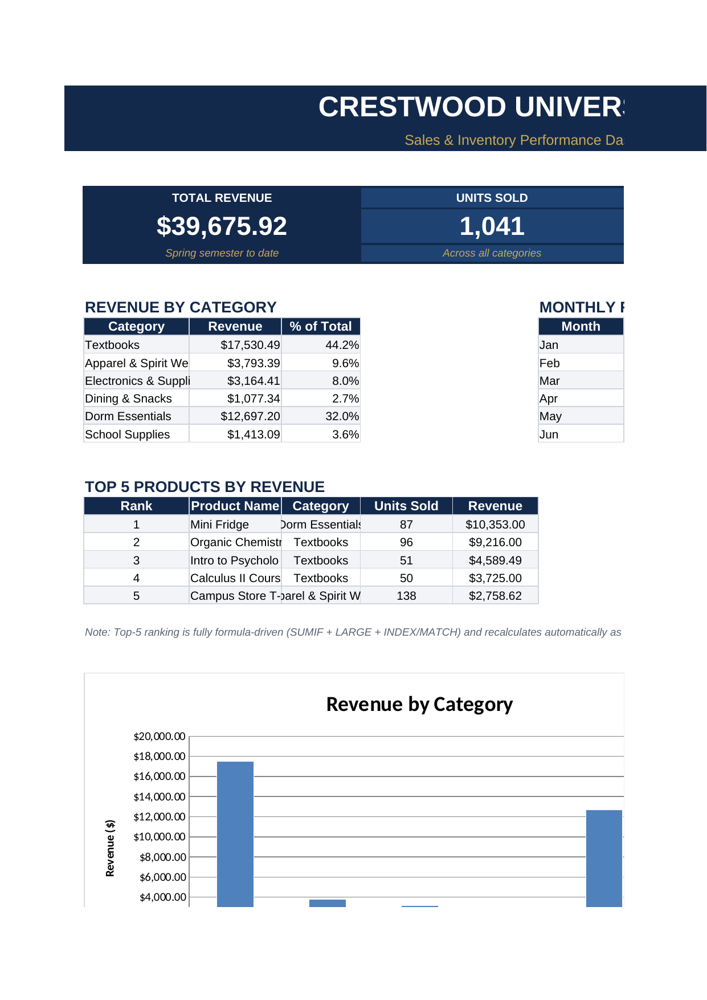

# Campus Store — Sales & Inventory Performance Dashboard

An Excel dashboard built for a fictional university campus store, turning raw
point-of-sale data into a live executive summary: revenue by category,
monthly trend, stock health, and a formula-driven top-sellers list — all
powered by one flat transaction log, with zero manual re-entry.



## What's included

| File | Purpose |
|---|---|
| `campus_store_sales_inventory_dashboard.xlsx` | The full workbook — Dashboard, Inventory, and Sales Log sheets |
| `dashboard_preview.png` | Screenshot of the Dashboard sheet, for a quick look without opening Excel |

## Structure

The workbook has three sheets, each with one job:

- **Sales Log** — the raw data. One row per transaction: date, product,
  category, quantity, unit price, revenue, payment method. This is the only
  sheet anyone would ever add new rows to.
- **Inventory** — the product register: unit price, stock quantity, reorder
  level, computed stock value, and a status flag (`OK` / `REORDER`). Includes
  a small summary block (total SKUs, total stock value, items needing
  reorder).
- **Dashboard** — nothing is typed here except labels. Every number is a
  formula that reads from the two sheets above.

## What's on the Dashboard

- **KPI strip** — total revenue, units sold, average order value, and items
  below reorder threshold, each pulled live from the source sheets.
- **Revenue by Category** (bar chart) — category totals via `SUMIF` against
  the Sales Log.
- **Monthly Revenue Trend** (line chart) — revenue and transaction count by
  month.
- **Stock Status Overview** (pie chart) — count of `OK` vs `REORDER` items,
  via `COUNTIF` against the Inventory sheet's status column.
- **Top 5 Products by Revenue** — fully formula-driven, not manually ranked:
  `LARGE` pulls the 5 highest per-product revenue totals, `INDEX/MATCH`
  resolves which product each one belongs to, and `VLOOKUP` pulls in its
  name and category. Add a better month to the Sales Log and this list
  reorders itself.

## Formulas worth pointing out

```
Category revenue:     =SUMIF('Sales Log'!$E$5:$E$111, B12, 'Sales Log'!$H$5:$H$111)
Reorder count:        =COUNTIF(Inventory!$H$5:$H$22, "REORDER")
Top-5 ranking key:    =LARGE($Q$12:$Q$29, 1)         ' 1st, 2nd, ... 5th highest revenue
Product lookup:       =INDEX($P$12:$P$29, MATCH(F22, $Q$12:$Q$29, 0))
Name/category pull:   =VLOOKUP(<resolved product>, Inventory!$A$5:$D$22, 2, FALSE())
```

The ranking logic is worth a second look for anyone reviewing the sheet:
`LARGE` finds the Nth-highest revenue value, `MATCH` finds which product ID
produced that value, and `INDEX` returns it — then a normal `VLOOKUP` fills
in the product's name and category from the Inventory sheet. Nothing here
is a hardcoded ranking; change any transaction and the whole table
recalculates.

## Opening it

Open `campus_store_sales_inventory_dashboard.xlsx` in Excel, Google Sheets,
or LibreOffice Calc. All three render the charts and formulas correctly.
To see it update live, add a new row to the Sales Log with a product,
quantity, and price — the KPI strip, all three charts, and the Top 5 table
recalculate automatically.
